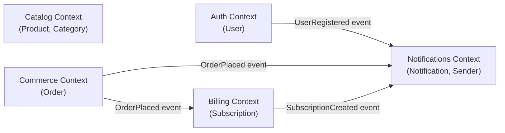

# Architecture

> Mermaid рендериться нативно в GitHub і в Obsidian (плагін `mermaid-tools`).

## Bounded Contexts

5 BC поточної системи:

- **Auth** — `User`. Реєстрація, логін, паролі (bcrypt)
- **Catalog** — `Product`, `Category`. Каталог продуктів
- **Commerce** — `Order`. Кошик, замовлення (спрощений — без cart entity)
- **Billing** — `Subscription`. Підписки на плани (basic / pro / enterprise)
- **Notifications** — `Notification`. Email / push доставка через Sender port

## BC Map

## Інтеграційні патерни

| Патерн | Де використовуємо |
|---|---|
| **Domain Events (асинхронно)** | Всі cross-BC звʼязки через `shared/events.Bus` (in-memory pub/sub) |
| **Repository** | Interface у `<bc>/domain/`, реалізація у `<bc>/infra/postgres/` |
| **Hexagonal / Ports & Adapters** | Domain визначає порти (`UserRepository`, `Sender`), infra реалізує адаптери |
| **Shared Kernel** | `shared/apperr/`, `shared/httputil/`, `shared/events/` — тільки cross-cutting |
| **Module pattern** | `<bc>/module.go` self-wires залежності і повертає `*Module` з RouteRegistrar |

## Як читати цей граф

- **Стрілка з підписом події** — асинхронна комунікація через event bus. BC-публікатор не знає про підписників. BC-підписник реєструє handler у `<bc>/infra/events/subscriber.go`
- **Catalog** на даному етапі не публікує події — це read-only BC
- **Notifications** — sink BC, тільки слухає. Не публікує власних подій (можна додати `NotificationSent` для analytics, поки не потрібно)
- Спроба прямого імпорту cross-BC (наприклад, `commerce/app/service.go` імпортує `auth/domain`) падає на `make arch-test`

## Як додати новий BC

1. Створи `<new-bc>/{domain,app,infra}/`
2. Додай ноду в mermaid-граф вище
3. Додай стрілки подій до існуючих BC (вхідні і вихідні)
4. Додай рядок у список BC на початку цього файлу
5. Додай `<new-bc>/module.go` з self-wiring
6. Зареєструй `<new-bc>` у `main.go`
7. Додай мапінги у `.arch-lint.yml` (components + deps)
8. Додай `.claude/rules/<new-bc>.md` зі scoped правилами
9. Запусти `make arch-test` — має пройти
