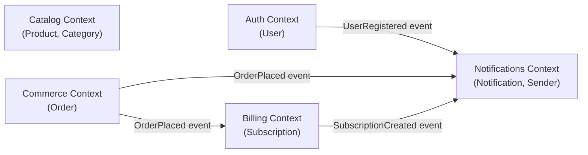

# Architecture

> Mermaid renders natively in GitHub and in Obsidian (`mermaid-tools` plugin).

## Bounded Contexts

5 BCs in the current system:

- **Auth** — `User`. Registration, login, password hashing (bcrypt)
- **Catalog** — `Product`, `Category`. Product catalog
- **Commerce** — `Order`. Cart, orders (simplified — no cart entity)
- **Billing** — `Subscription`. Subscription plans (`basic` / `pro` / `enterprise`)
- **Notifications** — `Notification`. Email / push delivery via `Sender` port

## BC Map

## Integration patterns

| Pattern | Where we use it |
|---|---|
| **Domain Events (async-style)** | All cross-BC links go through `shared/events.EventBus` (in-memory pub/sub) |
| **Repository (Protocol)** | Port declared in `app/<bc>/domain/repository.py`, implementation in `app/<bc>/infra/postgres/` |
| **Hexagonal / Ports & Adapters** | Domain declares Protocols (`UserRepository`, `Sender`), infra implements them |
| **Shared Kernel** | `app/shared/apperr.py`, `app/shared/httputil.py`, `app/shared/events.py`, `app/shared/db.py` — only cross-cutting |
| **Module pattern** | `app/<bc>/module.py` self-wires deps and returns a `Module` exposing `routes()` |

## How to read the graph

- **Arrow with event label** — async communication through the bus. The
  publisher BC does not know about subscribers. The subscriber BC registers
  a handler in `app/<bc>/infra/events/subscriber.py`
- **Catalog** does not publish events at this stage — it is a read-only BC
- **Notifications** is a sink BC: it only listens. It does not publish its
  own events yet (a `NotificationSent` for analytics is a future addition)
- A direct cross-BC import (e.g. `app/commerce/app/service.py` importing
  `app/auth/domain/...`) trips `make arch-test` (`import-linter` `independence` contract)

## How to add a new BC

1. Create `app/<new-bc>/{domain,app,infra}/` (with `__init__.py` everywhere)
2. Add a node to the mermaid graph above
3. Add event arrows to the existing BCs (incoming and outgoing)
4. Add a row to the BC list at the top of this file
5. Create `app/<new-bc>/module.py` with a `New(...)` builder
6. Register `app/<new-bc>/module` in `app/main.py`
7. Add the new module to `importlinter.ini` (in the `independence` contract
   modules list and a new `layers-<new-bc>` contract)
8. Add `.claude/rules/<new-bc>.md` with scoped rules
9. Run `make arch-test` — must pass
