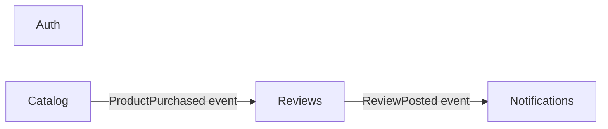

# Промпти зі скринкастів — лекція 4.8 Bounded Contexts

Точні промпти, які використовуються у кожному з 6 скринкастів. Скопіюй відповідний блок у Claude Code і відтвориш матеріал.

---

## Скринкаст 1 — той самий промпт, дві різні структури

**Контраст:** одне й те саме питання на flat і на hexagonal. У першому випадку Claude вгадує (3 варіанти), у другому дає однозначну відповідь.

### Запуск 1: stage-1-flat

```bash
cd 4.8-bc/go/stage-1-flat
claude
```

### Промпт

```
Куди мені покласти функцію відправки welcome-email новим користувачам?
```

### Очікуваний артефакт (stage-1-flat)

Claude вгадує — пропонує один з варіантів без впевненості:
- `app/service/user.go`
- `app/service/email.go`
- `app/helpers/notify.go`

Структура `handler/service/repo` плоска, BC не виражений → відповідь не однозначна.

### Запуск 2: stage-3-hexagonal

```bash
cd 4.8-bc/go/stage-3-hexagonal
claude
```

Той самий промпт.

### Очікуваний артефакт (stage-3-hexagonal)

Одна однозначна відповідь:
- Файл: `notifications/app/service.go`
- Subscriber на `auth.UserRegistered` у `notifications/infra/events/subscriber.go`
- Шлях прописаний у `CLAUDE.md` і захищений `make arch-test`

---

## Скринкаст 2 — Event Storming lite → папки

**Контраст:** 12 пост-ітів у 5 кольорових рамках з Excalidraw → 5 папок у `app/`.

### Excalidraw

12 пост-ітів з подіями:
```
UserRegistered, EmailVerified              → Auth (помаранчевий)
ProductViewed, WishlistAdded               → Catalog (зелений)
CartCreated, OrderPlaced,
PaymentFailed, PaymentSuccess              → Commerce (синій)
OrderShipped, DeliveryConfirmed            → Fulfillment (жовтий)
EmailSent, PushSent                        → Notifications (рожевий)
```

### Перехід до коду

```bash
cd 4.8-bc/go/stage-2-feature-first
tree -L 1 app/
```

### Очікуваний артефакт

```
app/
├── auth/
├── catalog/
├── commerce/
├── billing/
└── notifications/
```

Та сама пʼятірка контекстів зі стікерів — тепер як пʼять папок.

---

## Скринкаст 3 — три плани папок паралельно

**Контраст:** 3 термінали в 3 папках monorepo показують одну й ту саму фічу `notifications` на 3 рівнях зрілості.

### Термінал 1: stage-1-flat

```bash
cd 4.8-bc/go/stage-1-flat
tree -L 2 app/
```

Очікуваний артефакт:
```
app/
├── handler/
│   ├── user.go
│   └── notification.go
├── service/
│   ├── user.go
│   └── notification.go
└── repository/
    ├── user.go
    └── notification.go
```

`notifications` не існує як одиниця — лише функції, розкидані по шарах.

### Термінал 2: stage-2-feature-first

```bash
cd 4.8-bc/go/stage-2-feature-first
tree -L 2 app/notifications/
```

Очікуваний артефакт:
```
app/notifications/
├── handler.go
├── service.go
├── repository.go
└── model.go
```

Окрема папка — увесь код фічі разом.

### Термінал 3: stage-3-hexagonal

```bash
cd 4.8-bc/go/stage-3-hexagonal
tree -L 3 notifications/
```

Очікуваний артефакт:
```
notifications/
├── domain/
│   ├── notification.go
│   └── repository.go
├── app/
│   └── service.go
└── infra/
    ├── postgres/
    │   └── repo.go
    └── http/
        ├── handler.go
        ├── routes.go
        └── dto.go
```

---

## Скринкаст 4 — arch-test ловить порушення (Go / TS / Py)

**Контраст:** одне й те саме порушення меж — три різних інструмента, єдиний результат: CI fails.

### Go: go-arch-lint

```bash
cd 4.8-bc/go/stage-3-hexagonal
```

Відкрий `notifications/domain/notification.go` і додай навмисне порушення — імпорт з чужого BC і з infra-шару:

```go
import "github.com/genkovich/claude-course-demos/4.8-bc/go/stage-3-hexagonal/billing/infra/postgres"
```

Запусти:
```bash
make arch-test
```

Очікуваний артефакт:
```
✗ notifications/domain/notification.go:6
  imports billing/infra/postgres
  violation: domain cannot depend on infra
  violation: cross-context import not allowed
```

Виправ через інверсію:
1. Створи `notifications/domain/payment_status.go` з `interface PaymentStatusReader`
2. Реалізацію залиш у `billing/infra` (там вона і має бути, бо це адаптер до постгресу білінгу)
3. Інжекти interface через DI у `notifications/app/service.go`
4. Запусти `make arch-test` знову → `✓ No violations found`

### TS: dependency-cruiser

```bash
cd 4.8-bc/ts/stage-3-hexagonal
npm run arch:check
```

Те саме порушення (cross-context import у `notifications/domain`) → `dependency-cruiser` падає з error на правилі `no-cross-context`.

### Python: import-linter

```bash
cd 4.8-bc/py/stage-3-hexagonal
lint-imports
```

Те саме порушення → `import-linter` падає на контракті `independence` між `notifications` і `billing`.

**Висновок:** інструмент різний (`go-arch-lint`, `dependency-cruiser`, `import-linter`), формати повідомлень відрізняються — правило одне і ловиться автоматично у CI.

---

## Скринкаст 5 — AI кладе код у правильне BC (кульмінація)

**Контраст:** Claude генерує endpoint, і файл потрапляє у правильний BC автоматично — без явних інструкцій про шлях.

### Запуск

```bash
cd 4.8-bc/go/stage-3-hexagonal
claude
```

### Промпт

```
Додай endpoint POST /notifications/test, що приймає userID
і шле тестовий email через існуючий Sender.
```

### Очікуваний артефакт

Claude автоматично:
- Створює `notifications/infra/http/handler.go` (НЕ `main.go`, НЕ `shared/`)
- Реюзає `notifications/app/service.go` — не дублює логіку
- НЕ імпортує з `auth/` чи `billing/` напряму
- Реєструє route у `notifications/infra/http/routes.go` через registrar pattern
- Запускає `make arch-test` після генерації → `✓ No violations found`

Це і є кульмінація лекції. CLAUDE.md з BC-правилами + arch-test = поведінка Claude передбачувана.

---

## Скринкаст 6 — BC Map як живий документ

**Контраст:** ARCHITECTURE.md з mermaid рендериться однаково в Obsidian і в GitHub PR preview. Додавання нового BC = додавання ноди + 2 стрілок у mermaid.

### Запуск

```bash
cd 4.8-bc/go/stage-3-hexagonal
cursor ARCHITECTURE.md
```

(або `code` / `vim` / `obsidian://...`)

### Дія

Покажи рендер mermaid BC Map в Obsidian (плагін `mermaid-tools`) — графічна діаграма пʼяти контекстів зі стрілками подій. Покажи той самий файл у preview на GitHub — браузер рендерить mermaid нативно.

Тепер додай новий BC `reviews` (відгуки на товари):
1. Створи папки `reviews/{domain,app,infra}` з порожніми entity і service
2. Онови `ARCHITECTURE.md` — додай рядок у секцію BC list і ноду в mermaid-граф
3. Додай дві стрілки подій: `Catalog → Reviews` (`ProductPurchased`) і `Reviews → Notifications` (`ReviewPosted`)

### Очікуваний артефакт у `ARCHITECTURE.md`



Збережи файл, перезавантаж preview в Obsidian — граф перемальовується автоматично.

**Висновок:** BC Map — не одноразова PowerPoint-діаграма. Це жива секція в `ARCHITECTURE.md`, що оновлюється з кожним новим контекстом.
